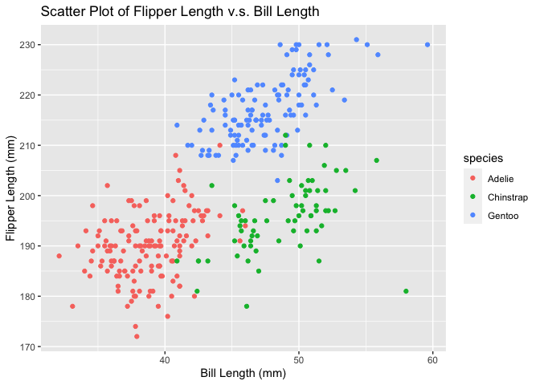

P8105 HW1
================
Shihui Zhu
2021-09-21

# Problem 1

## Create a Data Frame

-   a random sample of size 10 from a standard Normal distribution

``` r
set.seed(1)
samp <- rnorm(10)
```

-   a logical vector indicating whether elements of the sample are
    greater than 0

``` r
log_vec <- samp > 0
```

-   a character vector of length 10

``` r
char_vec <- c("This", "is", "a", "data", "science", "class", "please", "bring", 
            "your", "computer")
```

-   a factor vector of length 10, with 3 different factor “levels”

``` r
factor_vec <- factor(c(1,1,2,3,3,2,3,1,3,2))
```

``` r
df <- data.frame(samp, log_vec, char_vec, factor_vec)
df
```

    ##          samp log_vec char_vec factor_vec
    ## 1  -0.6264538   FALSE     This          1
    ## 2   0.1836433    TRUE       is          1
    ## 3  -0.8356286   FALSE        a          2
    ## 4   1.5952808    TRUE     data          3
    ## 5   0.3295078    TRUE  science          3
    ## 6  -0.8204684   FALSE    class          2
    ## 7   0.4874291    TRUE   please          3
    ## 8   0.7383247    TRUE    bring          1
    ## 9   0.5757814    TRUE     your          3
    ## 10 -0.3053884   FALSE computer          2

## Take mean of each variable

``` r
library(tidyverse)
```

``` r
# Mean of random sample
mean(dplyr::pull(df, 1))
## [1] 0.1322028
# Mean of logical vector
mean(dplyr::pull(df, 2))
## [1] 0.6
# Mean of char vector
mean(dplyr::pull(df, 3))
## Warning in mean.default(dplyr::pull(df, 3)): argument is not numeric or logical:
## returning NA
## [1] NA
# Mean of factor vector
mean(dplyr::pull(df, 4))
## Warning in mean.default(dplyr::pull(df, 4)): argument is not numeric or logical:
## returning NA
## [1] NA
```

The calculation for the mean of the first (random sample of 10 from a
standard normal distribution) and second variable (logical vector)
works. For character vector and factor vector, it does not work.

## Convert Variables

``` r
as.numeric(log_vec)
as.numeric(char_vec)
as.numeric(factor_vec)
```

There is a warning message showing for the character vector, saying NAs
introduced by coercion. The characters do not have meanings in numeric
values, therefore they cannot be converted to numbers, and such coercion
makes R assign null values to them. This explains the null value I got
when I tried to take the mean of it.

# Problem 2

``` r
data("penguins", package = "palmerpenguins")
```

## Description

The penguins dataset consist of 8 different categories, species, island,
bill\_length\_mm, bill\_depth\_mm, flipper\_length\_mm, body\_mass\_g,
sex, year. There are 344 rows and 8 columns. The mean flipper length of
the penguins is 200.9152047 mm.

## Plots

``` r
ggplot(penguins, aes(x = bill_length_mm, y = flipper_length_mm, color = species)) + geom_point() + xlab("Bill Length (mm)") + ylab("Flipper Length (mm)") + ggtitle("Scatter Plot of Flipper Length v.s. Bill Length")
```

<!-- -->

``` r
ggsave("hw1_p2_scatter_plot.jpg")
```

    ## Saving 7 x 5 in image
